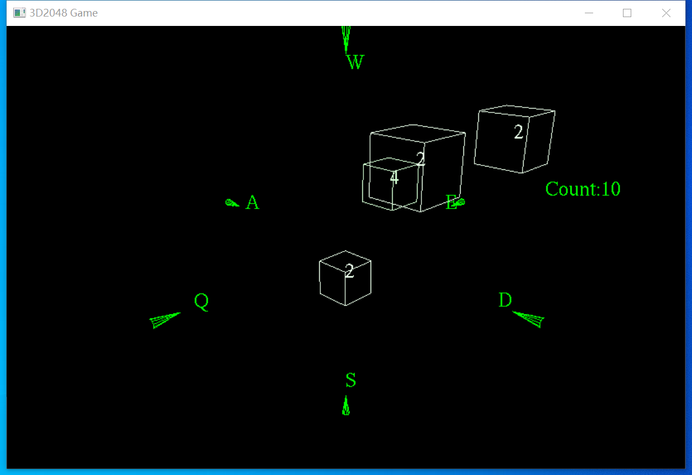
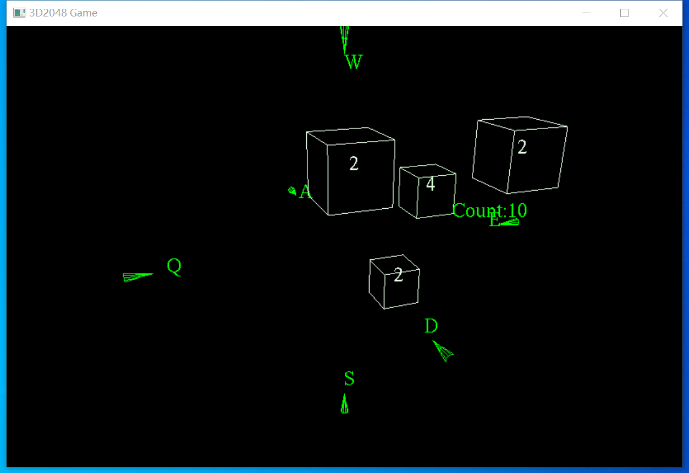
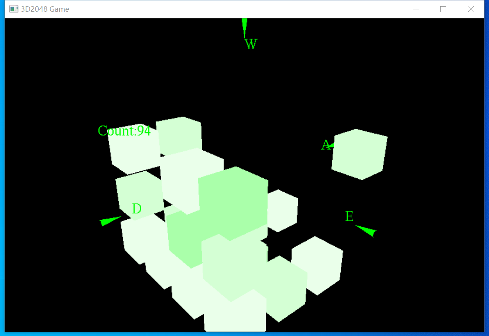
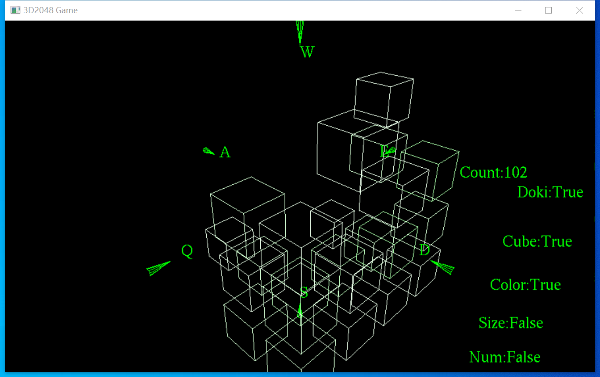

> 更多介绍放在我的博客中：dvjiang.github.io

## 程序概况

程序由C++语言编写，由图形显示和游戏逻辑两部分构成，其中图形显示使用的是OpenGL的Glut。

主程序作为main函数负责图形显示，而游戏部分作为GameSDK库函数存放于另一个文件中，并专门编写了一些查询函数对自己的库中内容进行提取。

第一版游戏为伪3D游戏，其游戏玩法没有做出太大改变，第二版游戏改为了4X4X4的真3D游戏，并有所创新。

在第二版游戏中，考虑到3D的2048使得玩家几乎不可能因为卡死而输掉游戏，而且2048几乎是必定达到的目标，将游戏的评分和目标改为了尽量在2048的方块生成时剩下尽量少的方块，除2048外剩下的数字越小，评分越高。

考虑到3D的2048会对排版布局有很大考验，我添加了一系列辅助工具来使得在二维上显示的三维图案足够清晰，同时，整个游戏采用简约风格，去掉了可能令人看花的光影，使用简单的线条和染色方块构造游戏画面。

## 效果演示

将.dll文件放在`C:\Windows\System32`下，即可打开.exe文件。

开始时，视角被放在一个可以看到六个角的位置，同时，QWEASD的位置也和游戏贴合。

游戏在立方体的四周按照方向摆放了锥形指示，并标上了键位提示。

通过小键盘可以改变视角位置：

利用QWEASD可以控制游戏，即方块的位置，同时，改变方块的显示方式，可以将线性的方块改为纯色的方块，其大小和颜色的深浅都和方块的数字有关。

同时，为了直观地了解到当前的设定，可以打开设置显示，让设置情况直接显示：

也可以看到，数字等内容也是可以关掉的。

## 实验结语及展望

可以看到，OpenGL的Glut很好的完成了图形界面的渲染和运动工作，使得游戏在3D情况下有很好的表现，且结构简单，效果显著。

本游戏框架可以用于更多简单游戏的设计及研发，Glut简单的交互方式和3D实现为现代游戏的编译提供了简洁有效的途径。

